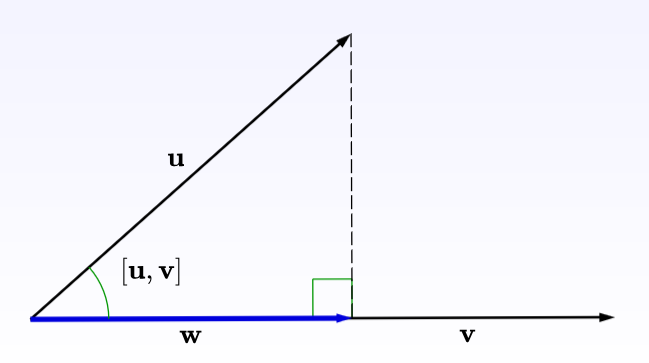

# SAT-Collision

The Separating Axis Theorem (SAT) is a mathematical method used in collision detection, especially for convex shapes (e.g., polygons, rectangles, circles). The theorem states:

**"Two convex shapes do not overlap if and only if there exists an axis along which their projections do not overlap."**

To project a point or vector onto an axis (a line in space), you use the dot product.

$\mathbf{w} = \frac{\mathbf{u} \cdot \mathbf{v}}{\|\mathbf{v}\|^2} \mathbf{v}$

